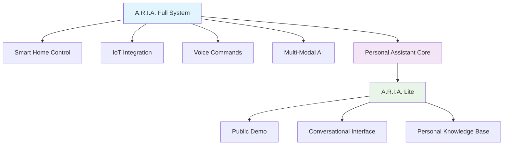
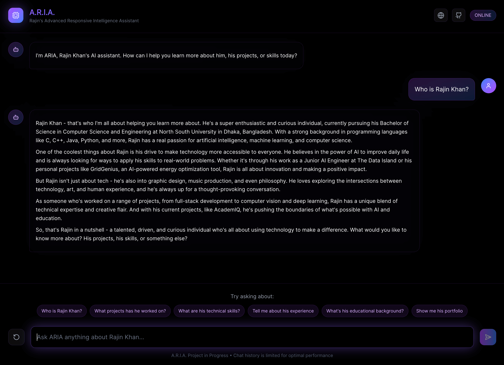
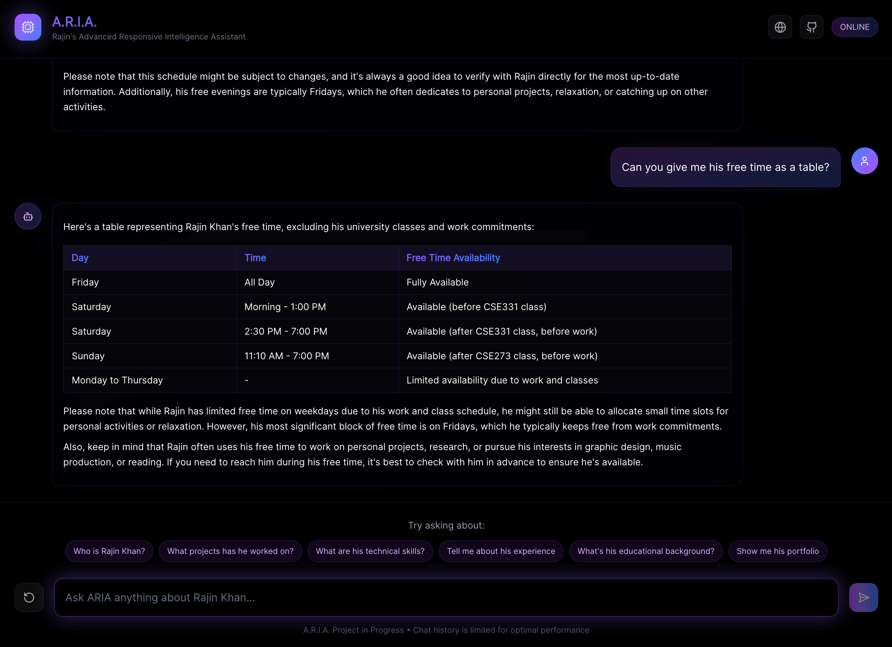

# A.R.I.A. Lite

-blueviolet?style=for-the-badge&logo=brain&logoColor=white)

---

## Overview

**A.R.I.A. Lite** is a public-facing demonstration of the conversational AI capabilities that power the full A.R.I.A. ecosystem - my own JARVIS-like personal assistant system currently in development. This streamlined version showcases sophisticated chatbot architecture through an intelligent personal assistant interface.

---

---

## ⚡ What A.R.I.A. Lite Does

A.R.I.A. Lite serves as an intelligent personal assistant that demonstrates:

- **Personal Knowledge Management** - Comprehensive information about the developer's background, skills, and projects
- **Professional Consultation** - Handles inquiries about services, availability, and collaboration opportunities  
- **Technical Discussion** - Engages in sophisticated conversations about development methodologies and AI implementation
- **Rapid Response Processing** - Sub-100ms query resolution with contextual awareness

---

## 📸 Screenshots

---

## 🚀 Why A.R.I.A. Lite Exists

This project serves as a **technical showcase** demonstrating:

### **Rapid Development Excellence**
- Complex AI system distilled into accessible public demo
- Production-ready architecture delivered at startup speed  
- Sophisticated conversation flows with consistent personality

### **Advanced Chatbot Architecture**
- Intelligent prompt engineering for natural interactions
- Optimized response generation and context management
- Seamless API integration with robust error handling

### **User Experience Design**  
- Intuitive conversational interface requiring no learning curve
- Context-aware responses that maintain conversation flow
- Professional presentation that builds trust and engagement

 

---

## 📊 Project Positioning

A.R.I.A. Lite represents the **conversational intelligence core** extracted from a much larger AI ecosystem. While the full A.R.I.A. platform encompasses smart home automation, IoT control, voice processing, and multi-modal AI capabilities, this public version focuses specifically on demonstrating sophisticated chatbot development and deployment.

